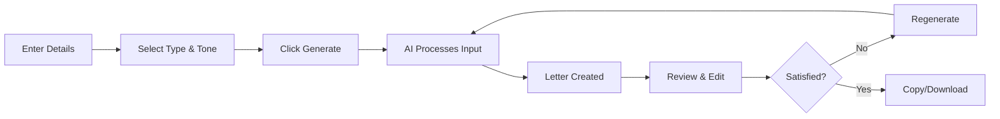

Letter Generator uses advanced AI to transform your basic inputs into well-crafted, professional letters instantly. The AI handles structure, language, tone, and formatting so you can focus on your message.

## How AI generation works

The generation process happens in seconds through several intelligent steps:

<Steps>
  <Step title="Input analysis">
    The AI analyzes your selected letter type, chosen tone, and provided details to understand your communication goal and context.
  </Step>
  
  <Step title="Structure creation">
    Based on the letter type, the AI builds an appropriate structure with proper sections, flow, and organization.
  </Step>
  
  <Step title="Content generation">
    The AI crafts compelling content that incorporates your details while applying best practices for that letter type.
  </Step>
  
  <Step title="Tone application">
    Your selected tone is applied consistently throughout the letter, affecting word choice, sentence structure, and overall voice.
  </Step>
  
  <Step title="Refinement">
    The AI polishes grammar, ensures coherence, and optimizes the letter for clarity and impact.
  </Step>
</Steps>

<Info>
The entire process takes just seconds, delivering a complete, ready-to-use letter instantly.
</Info>

## What the AI considers

When generating your letter, the AI takes multiple factors into account:

<AccordionGroup>
  <Accordion title="Letter type conventions">
    Each letter type has specific conventions and expectations. The AI understands these norms and structures your letter accordingly.
    
    **Examples:**
    - Cover letters include relevant experience and skills
    - Resignation letters maintain professionalism while stating departure
    - Recommendation letters provide specific examples and endorsements
    - Love letters use emotional and expressive language
  </Accordion>
  
  <Accordion title="Tone consistency">
    Your selected tone influences every aspect of the letter, from vocabulary to sentence complexity.
    
    **Examples:**
    - Professional tone uses formal language and business conventions
    - Friendly tone includes warm, approachable phrasing
    - Persuasive tone employs compelling arguments and calls to action
    - Empathetic tone shows understanding and emotional awareness
  </Accordion>
  
  <Accordion title="Context and details">
    The AI incorporates the specific information you provide, weaving it naturally into the letter.
    
    **Details used:**
    - Recipient name and relationship
    - Purpose and goal of the letter
    - Key points you want to communicate
    - Relevant dates, achievements, or events
    - Any special circumstances or context
  </Accordion>
  
  <Accordion title="Language and grammar">
    The AI ensures proper grammar, spelling, punctuation, and readability throughout.
    
    **Checks include:**
    - Grammatical correctness
    - Spelling accuracy
    - Punctuation placement
    - Sentence variety and flow
    - Paragraph organization
  </Accordion>
  
  <Accordion title="Best practices">
    The AI applies communication best practices to make your letter more effective.
    
    **Optimizations:**
    - Clear, concise language
    - Logical flow and transitions
    - Appropriate length for the letter type
    - Strong opening and closing
    - Action-oriented language where appropriate
  </Accordion>
</AccordionGroup>

## Generation workflow

Here's what happens when you click "Generate":

<Tip>
You can regenerate your letter as many times as you want to explore different approaches or refine the output.
</Tip>

## AI advantages

Using AI for letter generation provides significant benefits over writing from scratch:

<CardGroup cols={2}>
  <Card title="Speed" icon="bolt">
    Generate complete letters in seconds instead of spending hours writing and revising
  </Card>
  <Card title="Quality" icon="star">
    Produce professional-quality letters even without strong writing skills
  </Card>
  <Card title="Consistency" icon="equals">
    Maintain consistent tone and quality across all your communications
  </Card>
  <Card title="Confidence" icon="shield-check">
    Send letters knowing they follow conventions and best practices
  </Card>
</CardGroup>

## No writing skills required

The AI handles all the complex aspects of letter writing:

- **Structure** - Organizes your letter with proper sections and flow
- **Language** - Chooses appropriate vocabulary and phrasing
- **Tone** - Maintains consistent voice throughout
- **Grammar** - Ensures correctness in all technical aspects
- **Style** - Applies formatting and stylistic conventions
- **Impact** - Optimizes for clarity and persuasiveness

You simply provide the essential details and let the AI do the rest.

<Note>
Even if you're a strong writer, the AI saves significant time and ensures you don't miss important conventions.
</Note>

## Input requirements

To generate effective letters, you'll provide:

<CardGroup cols={2}>
  <Card title="Letter type" icon="list">
    Choose from 25+ types to set the format and structure
  </Card>
  <Card title="Tone selection" icon="sliders">
    Pick from 17 tones to control the voice and style
  </Card>
  <Card title="Essential details" icon="pen">
    Provide key information like names, purpose, and context
  </Card>
  <Card title="Additional info" icon="circle-plus">
    Include any special circumstances or specific points to address
  </Card>
</CardGroup>

The AI takes these inputs and generates a complete, polished letter.

## Generation customization

While the AI creates your letter automatically, you maintain control:

### Before generation

- **Letter type** - Determines structure and conventions
- **Tone selection** - Controls voice and style
- **Detail level** - More details yield more personalized letters
- **Language** - Choose from multiple languages for generation

### After generation

- **Edit freely** - Modify any part of the generated letter
- **Regenerate** - Create new versions with adjusted parameters
- **Copy/download** - Export in your preferred format
- **Try alternatives** - Generate multiple versions to compare

<Info>
The generated letter is your starting point. You can edit it as much or as little as you want.
</Info>

## Quality assurance

Every generated letter goes through AI quality checks:

<Steps>
  <Step title="Grammar verification">
    Ensures all sentences are grammatically correct and properly punctuated
  </Step>
  
  <Step title="Coherence check">
    Verifies that ideas flow logically and transitions are smooth
  </Step>
  
  <Step title="Tone consistency">
    Confirms the selected tone is maintained throughout the letter
  </Step>
  
  <Step title="Completeness validation">
    Ensures all essential components for that letter type are included
  </Step>
</Steps>

## Common generation patterns

### Professional letters

For business and workplace letters, the AI:
- Uses formal language and conventional structure
- Includes relevant qualifications and experience
- Maintains professional distance and objectivity
- Focuses on competence and reliability

### Personal letters

For personal and social letters, the AI:
- Incorporates emotional expression appropriate to the relationship
- Uses more personal and conversational language
- Includes warmth and personality
- Balances sentiment with clarity

### Persuasive letters

For letters designed to convince, the AI:
- Emphasizes benefits and positive outcomes
- Uses compelling language and strong arguments
- Includes calls to action
- Builds credibility and trust

## Generation limits

<CardGroup cols={2}>
  <Card title="Free tier" icon="hand-wave">
    Generous daily generation limit for casual users
  </Card>
  <Card title="Premium plans" icon="crown">
    Unlimited letter generation for heavy users
  </Card>
</CardGroup>

<Tip>
If you need to generate many letters or use the service frequently, consider upgrading to a premium plan for unlimited access.
</Tip>

## Best practices for AI generation

Get the best results by following these tips:

1. **Be specific** - Provide detailed information for more personalized letters
2. **Choose carefully** - Select the letter type and tone that best match your needs
3. **Review thoroughly** - Always read the generated letter before sending
4. **Edit as needed** - Customize the letter to perfectly match your situation
5. **Regenerate freely** - Don't settle for the first version if it's not quite right
6. **Compare options** - Try different tones or types to find the best approach

<Warning>
Always review AI-generated content before sending, especially for important or sensitive communications.
</Warning>

## Generation speed

Letter generation is nearly instantaneous:

- **Input processing** - Less than 1 second
- **Letter creation** - 2-3 seconds
- **Total time** - Complete letters in under 5 seconds

This speed allows you to iterate quickly, trying different approaches until you find the perfect version.

## Security and privacy

Your letter content is handled securely:

- **Secure interface** - All data transmitted over encrypted connections
- **Privacy focus** - Your letter content is used only for generation
- **No unauthorized access** - Letters are private to your account
- **User control** - You decide what to do with generated content

<Note>
Letter Generator is designed with security and privacy as priorities, ensuring your communications remain confidential.
</Note>